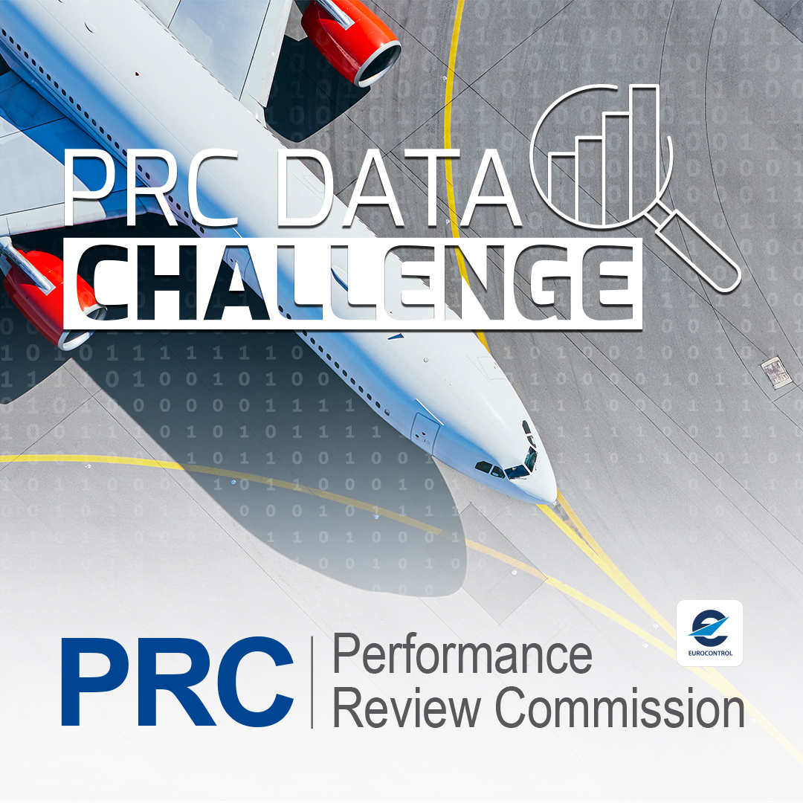

{.card-img-top .d-block style="margin-bottom: 0; max-width: 600px;" alt="PRC Data Challenge 2026 banner"}

The [\acr{PRC}](https://ansperformance.eu/about/prc/),
with the support of [\acr{OSN}](https://opensky-network.org/),
invites data scientists, aviation professionals and data analysts to collaborate
and compete in a data challenge to develop innovative methodologies for benefit
of the broader aviation community. 

The aim is to do this through: 

1. Using **open data**,

1. openly **sharing** final **solutions** (incl. code and documentation on a public GitHub repo),

1. **publishing** an **open access paper** about the implemented solution 
   on [\acr{JOAS}](https://journals.open.tudelft.nl/joas/) {style="max-width:32px;"}.

\newline
\newline

## Data Challenge

The 2026 edition of the \acr{PRC} Data Challenge invites participants to predict
the taxi-out time of flights from 11 major European airports.

##### **Scope**
The learning dataset will consist of all 11 airport movements for the full year of 2025.

##### **Ranking**
The applied ranking will use \acr{RMSE} for submitted predictions for the movements in January and July 2026.

##### **Timeline**
The competition runs from the **$1^{st}$ of September 2026** up until the **$11^{th}$ of October 2026 23:59:59 CET**. 

##### **Reward**
The combined **prize amount** for the first 3 teams is **5000 EUR**.  

##### **Terms & Conditions**
Check the Terms & Conditions for [eligibility for participation and prize](eligibility.qmd) before filling in the team creation request form.

##### **Participate**
Join the competition; request the creation of your team here! 

:::{.container .text-center}
[Request Team Creation!](https://example.com){.btn .btn-primary .btn-lg role="button" data-toggle="tooltip" title="Request Team Creation" target="_blank"}  
:::

::: {.callout-important title="Important"}
Your request will be assessed by the PRC Data Challenge team for approval.
Upon approval you will receive a verification email and, on successful reply,
the relevant access keys to the datasets/buckets.

[Note: The participation is open to all, but teams from sanctioned countries are excluded.]{.small }
:::

## Social Media Interactions & Forum

Join the conversation and stay up to date with the Data Challenge news and
announcements on [the OpenSky Network Discord channel `#prc-data-competition` ][prc-discord].  
Note: you need to have access to the [OpenSky Network Discord server](https://discord.gg/RPh89jpVVz) first.

[prc-discord]: <https://discord.com/channels/1252625490930307142/1304403918515605504> "Discord channel for PRC Data Challenge"

## Outreach

We are strong advocates of open science and (strongly 😉) encourage teams,
particularly the top-ranked teams, to submit a paper to \acr{JOAS}
describing their approach and the inner workings of their models.  
Here are some examples from previous editions: 

* [Open Machine Learning Models for Actual Takeoff Weight Prediction ](https://journals.open.tudelft.nl/joas/article/view/7963)
* [A Physics-Guided Gradient Boosting Framework for Open-Source Aviation Fuel Estimation ](https://journals.open.tudelft.nl/joas/article/view/8764)

We also publish a data paper describing the challenge dataset, with the aim of
making the data more accessible and supporting further use in research,
education, and other applications.  
Examples from previous editions include: 

* [Aircraft Fuel Burn Estimation: The EUROCONTROL PRC 2025 Data Challenge](https://journals.open.tudelft.nl/joas/article/view/8750)
* [Aircraft Takeoff Weight Estimation: The EUROCONTROL PRC 2024 Data Challenge](https://journals.open.tudelft.nl/joas/article/view/8252)

The following GitHub organizations host the repositories of participating teams:

* 2024 teams' repos, <https://github.com/prc-data-challenge-2024>
* 2025 teams' repos, <https://github.com/prc-data-challenge-2025>
